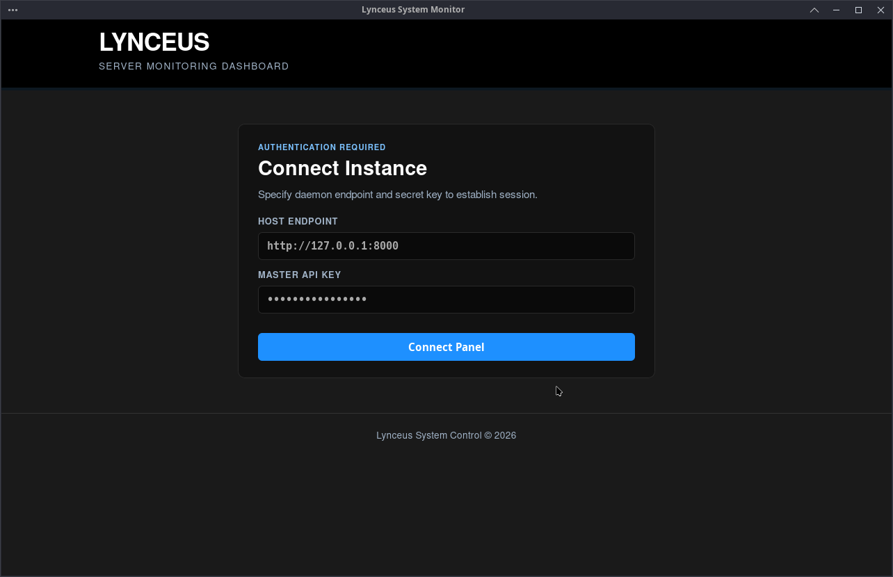
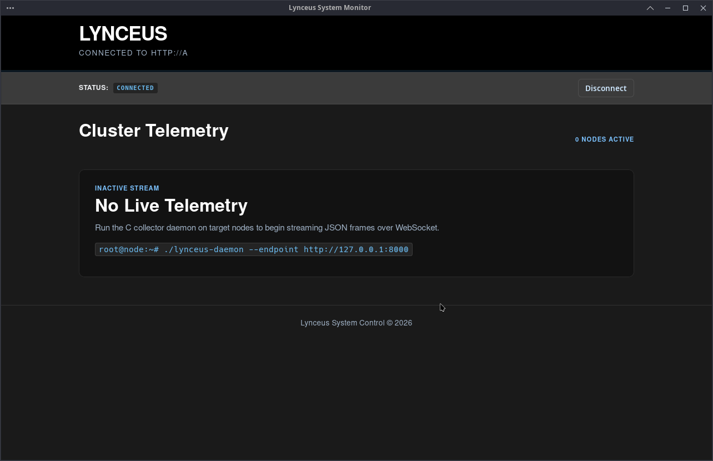

# Lynceus

[](LICENSE) []()[]()

Lynceus is a hybrid system monitoring platform designed to bridge low-level C telemetry collection with modern, real-time web visualization. 

The architecture consists of a lightweight C daemon running directly on monitored Linux hosts, an asynchronous Python backend handling persistent storage and stream orchestration, and a React frontend for dynamic status visualization.

## Architecture & Data Flow

1. **Agent (C11):** Interrogates Linux `/proc` interfaces (`/proc/stat`, `/proc/meminfo`, `/proc/net/dev`) to sample performance metrics with minimal system overhead, streaming payloads over WebSockets.
2. **Backend (Python / FastAPI):** Handles concurrent WebSocket connections from distributed agents, persists timeseries logs to PostgreSQL, and broadcasts real-time telemetry to connected dashboard clients.
3. **Frontend (React / TypeScript):** Renders live, responsive metric charts via Recharts, featuring connection status tracking and automated threshold warnings.
4. **AI Implementation** Whilst not directly shown anywhere in the app or the daemon. Usage of Large language models (Such as Claude Code, Google Gemini ...) has been used for Fixing code, writing some parts of the app and fixing some issues with server to app conections.

## Interface Preview

### Authentication & Host Connection
<p align="center">
  
</p>

### Cluster Telemetry View
<p align="center">
  
</p>

## Tech Stack

* **Agent Layer:** C11, POSIX Threads, Native Sockets, libwebsockets
* **Backend Layer:** Python 3.11, FastAPI, AsyncIO, SQLAlchemy, PostgreSQL
* **Frontend Layer:** React 18, TypeScript, Vite, Recharts, Tailwind CSS
* **Infrastructure:** Docker, Docker Compose

## Core Features

* **Sub-Second Telemetry:** Low-latency streaming of CPU utilization, RAM distribution, and network interface throughput.
* **Non-Blocking Architecture:** Fully asynchronous Python backend capable of multiplexing multiple agent ingestion feeds.
* **Modular Visualizations:** React components designed for isolated metric monitoring and multi-node dashboard layouts.

## Getting Started

### Prerequisites

* Docker and Docker Compose
* GCC / Clang (if building the C agent manually outside Docker)

### Quickstart

1. Clone the repository:
   ```bash
   git clone https://github.com/Kenraaliskuutteri/Lynceus.git
   cd Lynceus